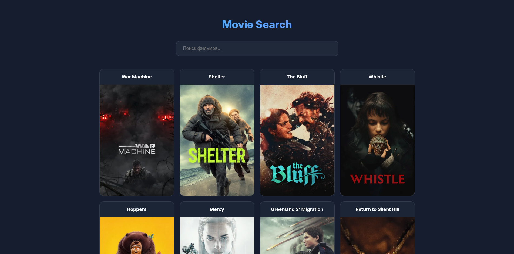

# 🎬 Movie Search App — React + TMDB API

Стильное веб-приложение для поиска фильмов, созданное на **React** с использованием **Vite**. Проект реализован в рамках учебного курса по веб-разработке.



## 🚀 Основные возможности

* **Живой поиск:** Поиск фильмов по базе TMDB в реальном времени.
* **Debouncing:** Оптимизация поисковых запросов (задержка перед отправкой), чтобы не перегружать API.
* **Пагинация:** Удобный переход по страницам результатов.
* **Glassmorphism Design:** Современный интерфейс с эффектом «стекла», адаптивной сеткой (CSS Grid) и темной темой.
* **Environment Variables:** Надежное хранение API-ключей в `.env` файлах.

## 🛠 Технологический стек

* **Frontend:** React (Hooks: `useState`, `useEffect`)
* **Сборка:** Vite
* **Стили:** CSS3 (Grid, Flexbox, Glassmorphism)
* **API:** [The Movie Database (TMDB)](https://www.themoviedb.org/)

## 📦 Как запустить проект

1. **Клонируйте репозиторий:**
	```bash
		git clone https://github.com/nextc0ders/movie-search.git
	```
2. **Установите зависимости:**
	```bash
		npm install
	```
3. Настройте API Key:
Создайте файл .env в корне проекта и добавьте туда свой ключ:
	```bash
		VITE_TMDB_API_KEY=твой_ключ_от_tmdb
	```
4. Запустите проект:
	```bash
		npm run dev
	```

## 📚 Что ты изучишь в этом проекте (Learning Goals)
1. Работа с асинхронными запросами (fetch) и обработка данных от сторонних сервисов.
2. Создание кастомной логики для Debouncing (оптимизация производительности).
3. Продвинутая верстка на CSS Grid без использования сторонних библиотек.
4. Управление сложным состоянием (синхронизация поиска и пагинации).
---
Создано с ❤️ в учебных целях.
---
### P.S.

* **`.gitignore`**: Обязательно проверь, чтобы твой файл `.env` был прописан в `.gitignore`. Ключ TMDB **не должен** попасть в репозиторий!
